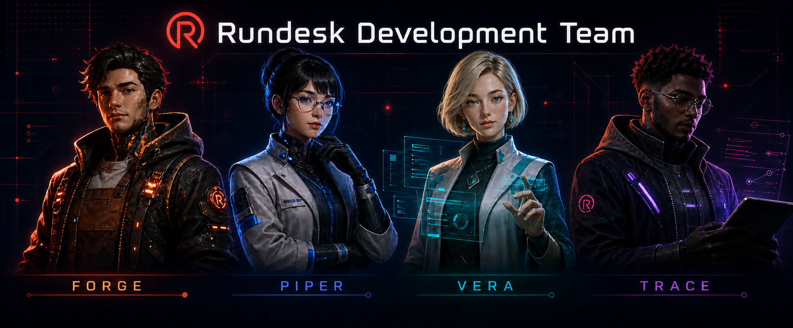

<p align="center">
  
</p>

# Rundesk Development Team

[](https://github.com/rundesk-ai/rundesk-team-development/actions/workflows/build.yml?query=branch%3Amain)
[](manifest.json)
[](LICENSE)

A versioned Rundesk development team: four specialists, their canonical instructions, and the
skills they use. Built for the [Rundesk CLI](https://github.com/rundesk-ai/rundesk-cli) agent
system, this repository is both an installable skill catalog and a team declaration.

## 👥 Team

| Member | Responsibility |
|---|---|
| `forge` | Implements bounded changes and the tests that prove them. |
| `piper` | Reviews completed work for correctness, safety, compatibility, and readiness. |
| `trace` | Investigates unknown failures and returns reproducible evidence without changing code. |
| `vera` | Defines and validates user-facing behavior, usability, accessibility, and recovery. |

A domain agent calls the right specialist directly, keeps ownership of the outcome, and integrates
the result.

Rundesk keeps each member's instructions and skill access aligned with this catalog.

## 🧠 Skills

### Orchestration

- `managing-development-work` — Coordinate software changes through verified completion.

### Design

- `designing-apis` — Design HTTP resources, contracts, errors, evolution, and security.
- `designing-databases` — Design data models, constraints, relationships, and growth.
- `designing-landing-pages` — Design and review campaign destinations, conversion paths, and their measurement handoffs.
- `designing-ui-ux` — Design flows, states, accessibility, interface text, and recovery.

### Engineering practice

- `debugging-code` — Reproduce failures, isolate causes, and prove safe corrections.
- `reviewing-code` — Judge completed changes and return ranked findings.
- `structuring-project-docs` — Place documentation in one home and keep its indexes true.
- `testing-code` — Choose reliable test boundaries and prove test sensitivity.
- `writing-technical-docs` — Document what software does now, traced to its current contracts.

### Frameworks and interfaces

- `using-laravel` — Apply Laravel conventions across backend development and operations.
- `using-inertia` — Handle the Inertia protocol, data loading, history, and SSR.
- `using-vuejs` — Build and test Vue 3 and Nuxt applications correctly.
- `using-reactjs` — Build and test modern React applications correctly.
- `using-tailwindcss` — Apply CSS behavior and Tailwind v4 composition correctly.

### Data systems

- `using-mysql` — Work safely with MySQL and InnoDB behavior.
- `using-postgres` — Work safely with PostgreSQL behavior and operations.
- `using-sqlite` — Work safely with SQLite's embedded database lifecycle.

### Languages and engines

- `using-python` — Build reliable, typed, secure, and tested Python software.
- `using-cpp` — Build correct modern C++ across toolchains and platforms.
- `using-axmol` — Build Axmol scenes, rendering, UI, and platform targets.

## 🚀 Install

Preview first, then confirm.

### Complete team

Install all skills and four managed agents:

```sh
rundesk teams install https://github.com/rundesk-ai/rundesk-team-development --provider <provider>
rundesk teams install https://github.com/rundesk-ai/rundesk-team-development --provider <provider> --confirm
```

Team installation creates the agents with their gateways stopped. Start only the agents you want to
use:

```sh
rundesk gateways start <agent>
```

Run installation from your terminal. To update the team later:

```sh
rundesk teams update rundesk-team-development --confirm
```

### Skills only

Install the catalog without creating agents:

```sh
rundesk skills install https://github.com/rundesk-ai/rundesk-team-development
rundesk skills install https://github.com/rundesk-ai/rundesk-team-development --confirm
rundesk skills grant <agent> rundesk-team-development/managing-development-work
```

This installs only the skills. You can add the complete team later without reinstalling them.

## ✅ Requirements

- A supported Rundesk CLI.
- Public GitHub access to this repository.
- For complete-team installation: a provider and an unused local name for every team member.

Skills are self-contained guidance that agents load when relevant.

## 🛠️ Development

Read [AGENTS.md](AGENTS.md), then run the complete offline gate:

```sh
python3 -m unittest discover -s tests -v
git diff --check
```

Skill changes also require verified source links and realistic forward tests. See
[skill validation](docs/guides/validation.md) and [team validation](docs/guides/team-validation.md).

## 🤝 Contributing

Use the repository templates:

- [Report a bug](.github/ISSUE_TEMPLATE/bug-report.md)
- [Propose a change](.github/ISSUE_TEMPLATE/change-proposal.md)
- [Prepare a pull request](.github/pull_request_template.md)

Keep the README, manifest, tests, team declaration, member instructions, and package tree in sync.

## 📄 License

MIT, except material in `designing-ui-ux` adapted under Apache License 2.0. See that package's
[source basis](skills/designing-ui-ux/references/sources.md).
